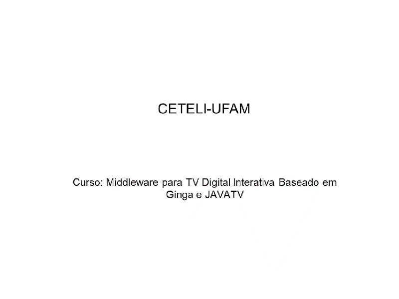

Curso **Middleware para TV Digital Interativa Baseado em Ginga e JAVATV** ministrado em parceria com Nairon Viana no projeto Treinamento de Jovens Engenheiros para Desenvolvimento de Software para TV Digital no Centro de P&D em Tecnologia Eletrônica da Informação (Ceteli) da Universidade Federal do Amazonas (Ufam) em agosto de 2008.

	<a class="btn btn-outline-primary mt-1" href="{{ site.baseurl }}/classes/">Voltar</a>

