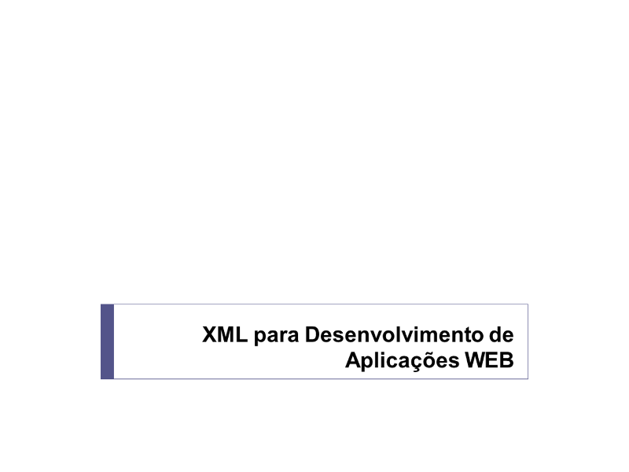

Disciplina XML para Desenvolvimento de Aplicações WEB ministrada na Especialização em Desenvolvimento de Software para Web do Instituto Federal do Amazonas (Ifam).

	<a class="btn btn-outline-primary mt-1" href="{{ site.baseurl }}/classes/">Voltar</a>

