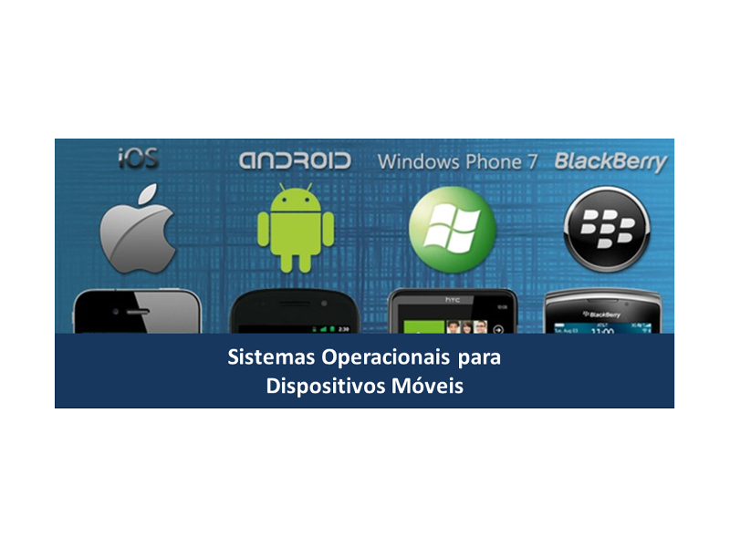

Curso **Sistemas Operacionais para Dispositivos Móveis** ministrado em parceria com Ricardo Erikson no Programa de Formação Complementar no Centro de P&D em Tecnologia Eletrônica da Informação (Ceteli) da Universidade Federal do Amazonas (Ufam) em dezembro de 2013.

	<a class="btn btn-outline-primary mt-1" href="{{ site.baseurl }}/classes/">Voltar</a>

