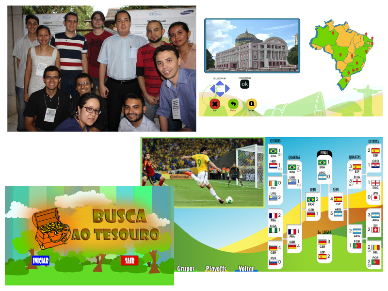

Orientador dos trabalhos Busca ao Tesouro, Walking Brazil e Copa DTV desenvolvidos no projeto Programa de Formação Complementar – Tecnologias para TV Digital durante o período de 01/11/2013 a 31/05/2014 no Centro de P&D em Tecnologia Eletrônica da Informação (Ceteli) da Universidade Federal do Amazonas (Ufam). 

	<a class="btn btn-outline-primary mt-1" href="{{ site.baseurl }}/classes/">Voltar</a>

