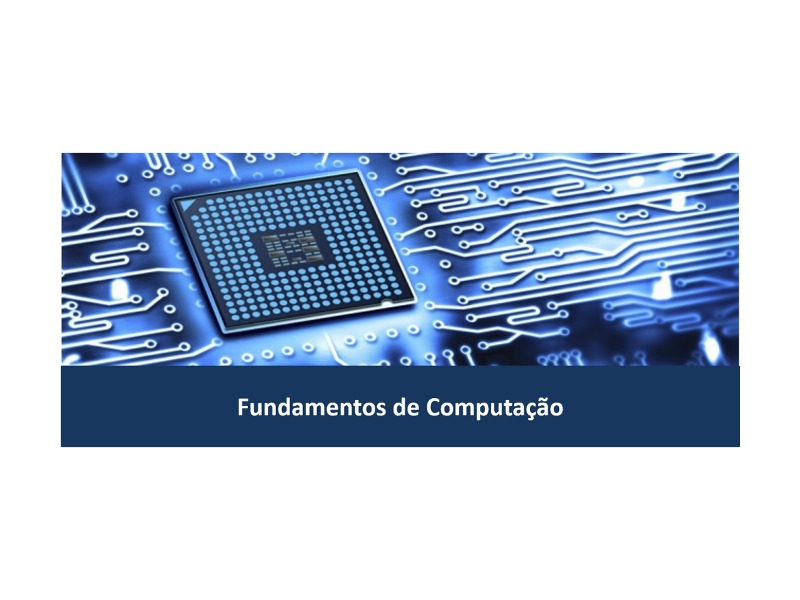

Disciplina **Fundamentos de Computação** (noturno) ministrada no primeiro período do curso Ciência da Computação do Centro Universitário do Norte (Uninorte) em 2015/1.

	<a class="btn btn-outline-primary mt-1" href="{{ site.baseurl }}/classes/">Voltar</a>

