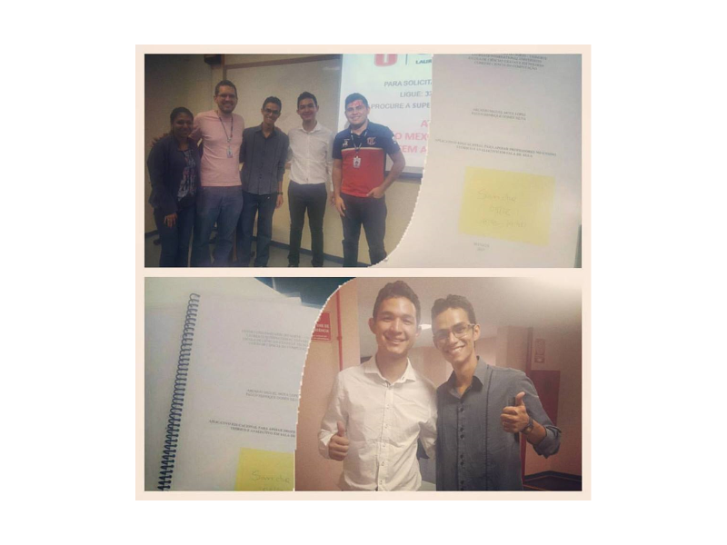

Orientação do trabalho de conclusão de curso intitulado **Aplicativo educacional para apoiar professores no ensino teórico e avaliativo em sala de aula** defendido pelos alunos Arcanjo Miguel Mota Lopes e Paulo Henrique Gomes Silva do curso de graduação em Ciência da Computação do Centro Universitário do Norte (Uninorte) no dia 10/12/2015. 

Participaram da banca a profa. Me. Francisca Sancha Azevedo e o prof. Me. Camilo Batista de Souza. 

	<a class="btn btn-outline-primary mt-1" href="{{ site.baseurl }}/classes/">Voltar</a>

