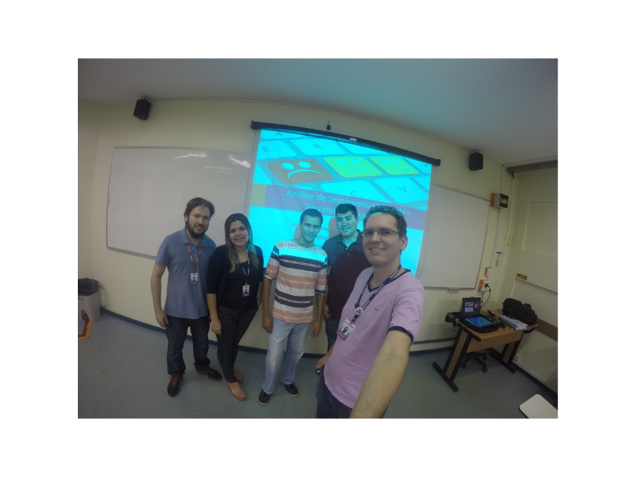

Orientação do trabalho de conclusão de curso intitulado **Análise de sentimento utilizando a ferramenta rapidminer** defendido pelos alunos Anderson Gonçalves Da Silva Gonçalves e Jardson Santos Da Silva do curso de graduação em Ciência da Computação do Centro Universitário do Norte (Uninorte) no dia 30/06/2016. 

Participaram da banca a profa. Me. Andreza Bastos Mourão e o prof. Me. Diego da Silva Froner. 

	<a class="btn btn-outline-primary mt-1" href="{{ site.baseurl }}/classes/">Voltar</a>

