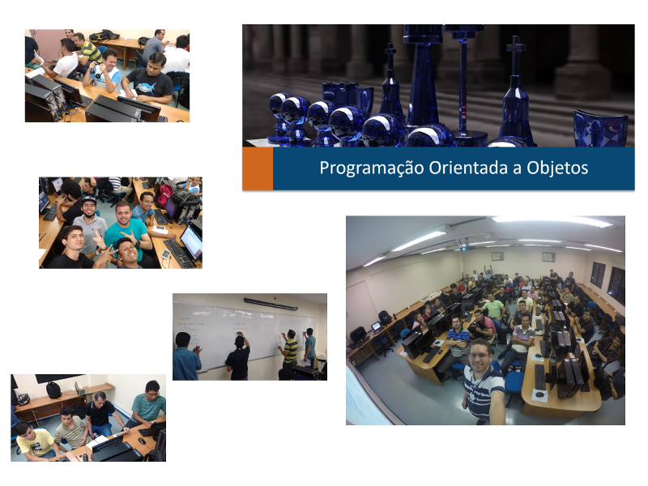

Disciplina **Programação Orientada a Objetos** (noturno) ministrada no quarto período do curso de Rede de Computadores do Centro Universitário do Norte (Uninorte) em 2016/2.

Exemplos de códigos vistos em sala de aula estão disponívels no [GitHub][poo-rcn04s1]{:target="_black"}.

[poo-rcn04s1]: https://github.com/orlewilson/poo-rcn04s1

	<a class="btn btn-outline-primary mt-1" href="{{ site.baseurl }}/classes/">Voltar</a>

