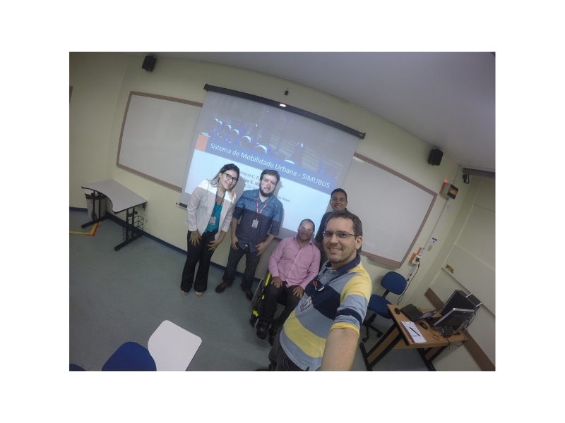

Orientação do trabalho de conclusão de curso intitulado **Sistema de mobilidade urbana - SIMUBUS** defendido pelos alunos Rodrigo S. Nascimento e Francisco C. P. C. Junior do curso de graduação em Ciência da Computação do Centro Universitário do Norte (Uninorte) no dia 14/12/2016. 

Participaram da banca o prof. Me. Diego da Silva Froner e a profa. Me. Natacsha Ordones Raposo. 

	<a class="btn btn-outline-primary mt-1" href="{{ site.baseurl }}/classes/">Voltar</a>

