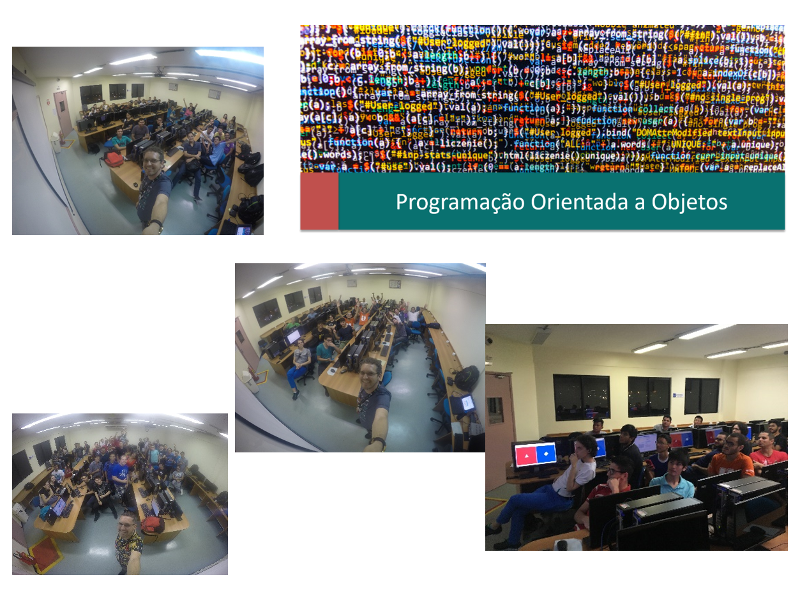

Disciplina **Programação Orientada a Objetos** ministrada nos cursos de Ciência da Computação e Engenharia da Computação do Centro Universitário do Norte (Uninorte) em 2017/2.

Exemplos de códigos vistos em sala de aula estão disponívels no [GitHub 1][github-exemplos-aula-1]{:target="_black"} e [GitHub 2][github-exemplos-aula-2]{:target="_black"}.

[github-exemplos-aula-1]: https://github.com/orlewilson/poo-cmn06s1-20172
[github-exemplos-aula-2]: https://github.com/orlewilson/poo-cin04s1-20172

	<a class="btn btn-outline-primary mt-1" href="{{ site.baseurl }}/classes/">Voltar</a>

