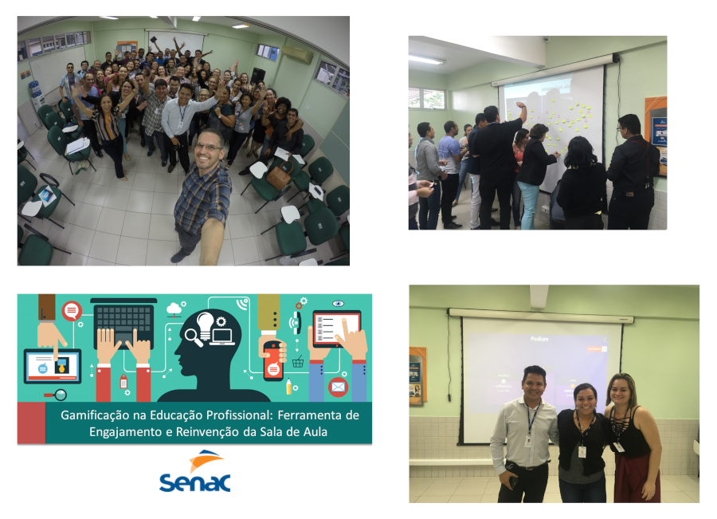

---
name:	Gamificação na Educação Profissional - Ferramenta de Engajamento e Reinvenção da Sala de Aula
tools: 	[presencial, treinamento corporativo, gamificação, educação profissional, 2018]
image: 	../img/courses/2018/senac-curso-gamificacao-educacao-profissional.png
date: 	2018-07-13
---

Treinamento corporativo **Gamificação na Educação Profissional - Ferramenta de Engajamento e Reinvenção da Sala de Aula** realizado no dia 13 de julho de 2018 na empresa **SENAC** em Manaus/AM.

	<a class="btn btn-outline-primary mt-1" href="{{ site.baseurl }}/courses/">Voltar</a>

