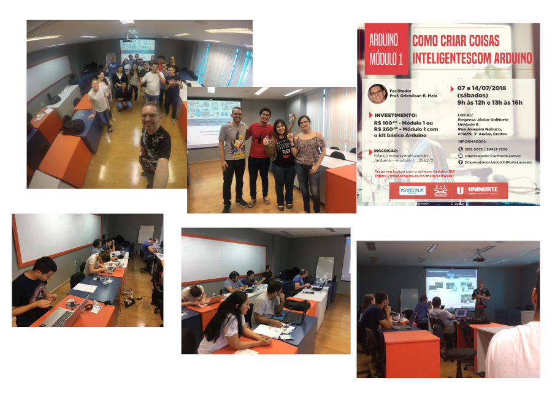

Curso **Como Criar Coisas Inteligentes com Arduino - Módulo 1** realizado nos dias 07 e 14 de julho de 2018 no Centro Universitário do Norte (Uninorte) pela Empresa Júnior em Manaus/AM.

O objetivo desse curso foi apresentar conceitos sobre Internet das Coisas (Internet of Things - IoT), bem como tornar coisas inteligentes por meio do Arduino e seus componentes.

	<a class="btn btn-outline-primary mt-1" href="{{ site.baseurl }}/courses/">Voltar</a>

