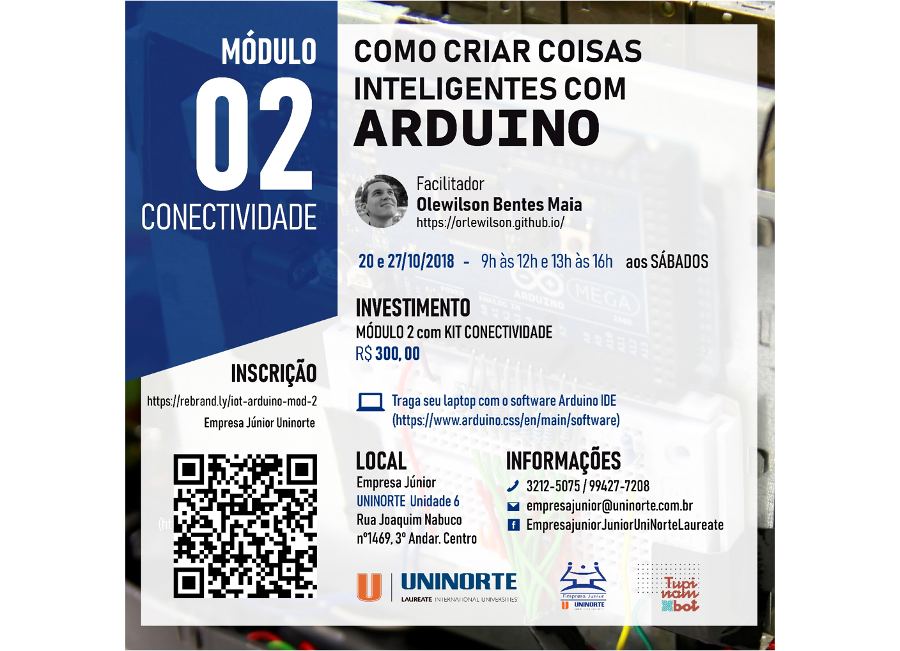

Curso realizado nos dias 20 e 27/10/2018 no [Centro Universitário do Norte/Laureate][uninorte-laureate]{:target="_black"} pela Empresa Júnior.

O objetivo desse curso foi utilizar Arduino no contexto de Internet das Coisas (IoT) por meio de exemplos práticos usando Bluetooth, Wifi e RFID.

[uninorte-laureate]: https://www.uninorte.com.br/

	<a class="btn btn-outline-primary mt-1" href="{{ site.baseurl }}/courses/">Voltar</a>

