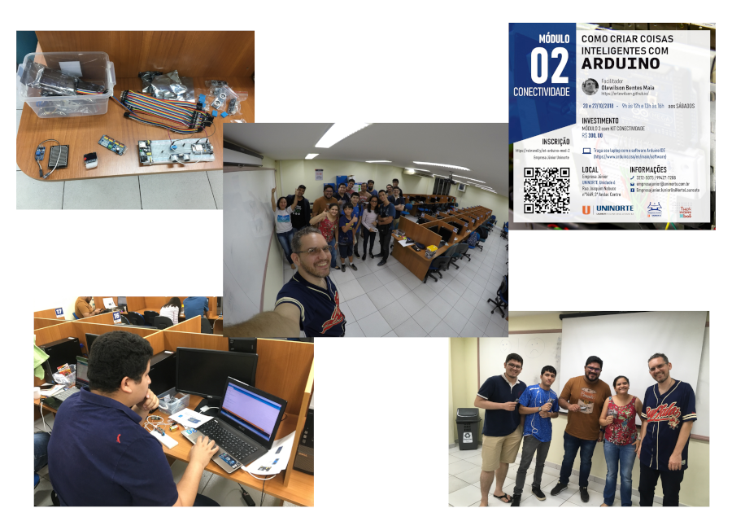

Curso **Como Criar Coisas Inteligentes com Arduino - Módulo 2** realizado nos dias 20 e 27 de outubro de 2018 no Centro Universitário do Norte (Uninorte) pela Empresa Júnior em Manaus/AM.

O objetivo desse curso foi utilizar Arduino no contexto de Internet das Coisas (IoT) por meio de exemplos práticos usando Bluetooth, Wifi e RFID.

	<a class="btn btn-outline-primary mt-1" href="{{ site.baseurl }}/courses/">Voltar</a>

