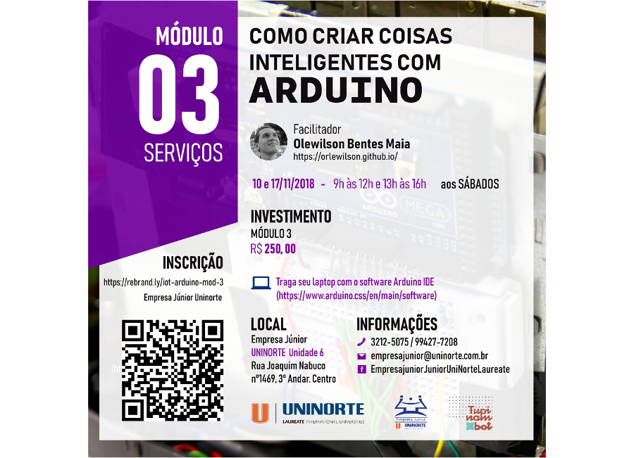

Curso realizado nos dias 10 e 17/11/2018 no [Centro Universitário do Norte/Laureate][uninorte-laureate]{:target="_black"} pela Empresa Júnior.

O objetivo desse curso foi criar serviços usando NodeJS com Arduino no contexto de Intenet das Coisas (IoT) por meio de exemplos práticos.

[uninorte-laureate]: https://www.uninorte.com.br/

	<a class="btn btn-outline-primary mt-1" href="{{ site.baseurl }}/courses/">Voltar</a>

