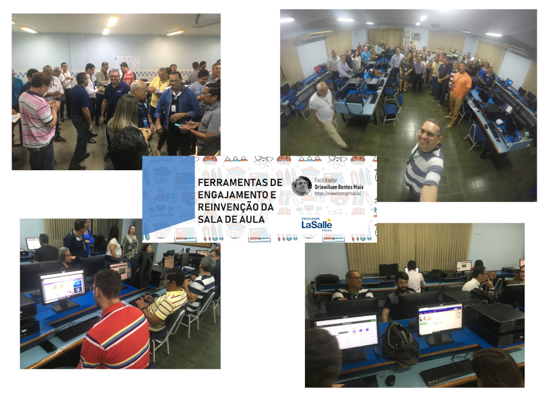

Treinamento corporativo **Ferramentas de Engajamento e Reinvenção da Sala de Aula** realizado nos dias 06 e 07 de fevereiro de 2019 na empresa **Faculdade La Salle** em Manaus/AM.

	<a class="btn btn-outline-primary mt-1" href="{{ site.baseurl }}/courses/">Voltar</a>

