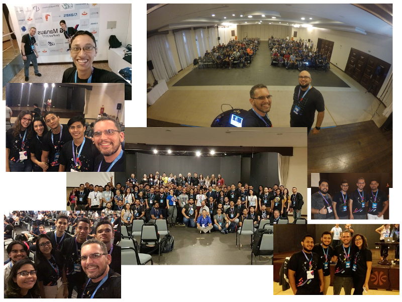

Palestra **Criando Coisas Conectadas com Android Things** ministrada no DevFest em Manaus/AM no dia 15 de novembro de 2017. Os slides estão disponíveis no [SlideShare][slideshare-devfest]{:target="_black"}.

[slideshare-devfest]: https://www.slideshare.net/orlewilson/como-criar-coisas-conectadas-com-android-things

	<a class="btn btn-outline-primary mt-1" href="{{ site.baseurl }}/events/">Voltar</a>

