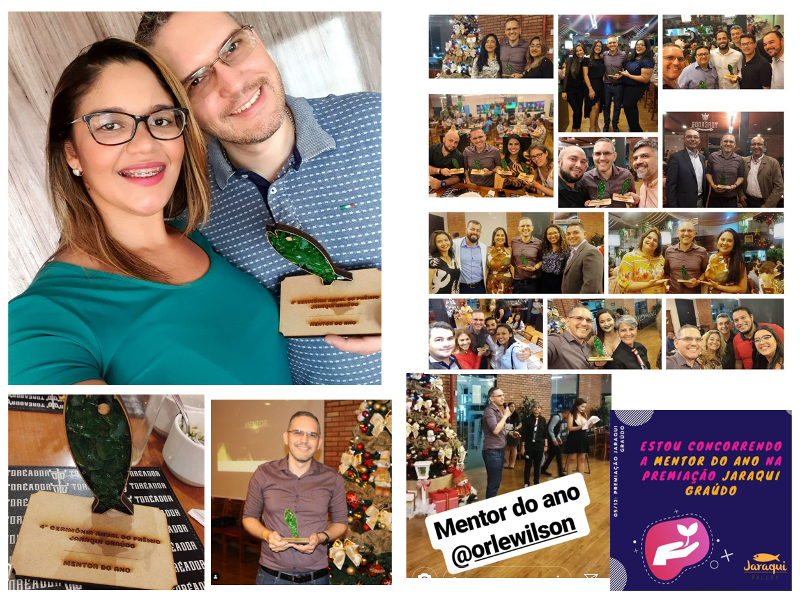

Em 2015 após participar de uma edição do Spark Awards (premiação da ABStartups) um grupo de membros do Jaraqui Valley resolveu tocar o desafio de realizar a premiação regional. A premiação Jaraqui Graúdo é uma cerimônia anual que visa reconhecer os destaques do ecossistema de inovação amazonense.

Não tenho palavras para agradecer por tanta felicidade. Fui escolhido como o mentor do ano do JARAQUÍ GRAÚDO 2019 organizado pelo Jaraqui Valley. Isso é resultado dos últimos anos que temos feito para melhorar nossa região. Digo nós mesmo por que esse prêmio compartilho com todos: a Faculdade Martha Falcão, a Sancha Azevedo, o João Clineu, o GDG Manaus, o Agile Manaus, o Educadores Inovadores da Amazônia, o Startup Weekend Manaus, o Roraima FullStack Developers e demais comunidades. Também agradeço o incentivo e apoio de meus amigos e em especial a Deus, a minha esposa Débora Mendonça e aos meus alunos. Muito obrigado por tudo!

	<a class="btn btn-outline-primary mt-1" href="{{ site.baseurl }}/events/">Voltar</a>

