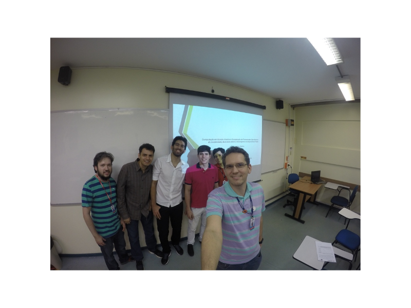

Orientação do trabalho de conclusão de curso intitulado **Computação em nuvem: analise e comparação de ferramentas open source do modelo iaas, buscando melhor desempenho de dispositivos finais** defendido pelos alunos Andrew Bastos, Eduardo Maia e William Barros do curso de graduação em Ciência da Computação do Centro Universitário do Norte (Uninorte) no dia 01/07/2016. 

Participaram da banca o prof. Me. Diego da Silva Froner e o prof. Me. Jonatas Costa de Oliveira. 

	<a class="btn btn-outline-primary mt-1" href="{{ site.baseurl }}/projects/">Voltar</a>

