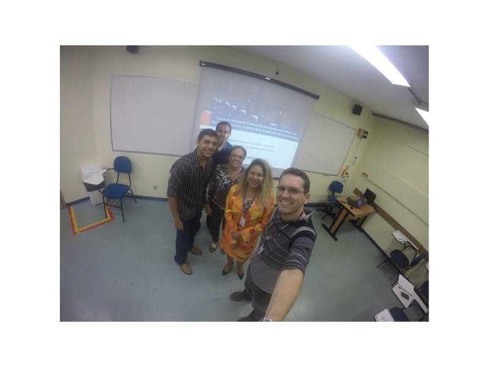

Orientação do trabalho de conclusão de curso intitulado **O uso da realidade aumentada para apoio ao professor no ensino da disciplina organização e arquitetura de computadores** defendido pelos alunos Emanuel C. Silva e Enos L. Gonçalves do curso de graduação em Ciência da Computação do Centro Universitário do Norte (Uninorte) no dia 13/12/2016. 

Participaram da banca a profa. Me. Ângela Timoria Pereira Lima e a profa. Me. Audilene Christina Farias dos Santos. 

	<a class="btn btn-outline-primary mt-1" href="{{ site.baseurl }}/projects/">Voltar</a>

