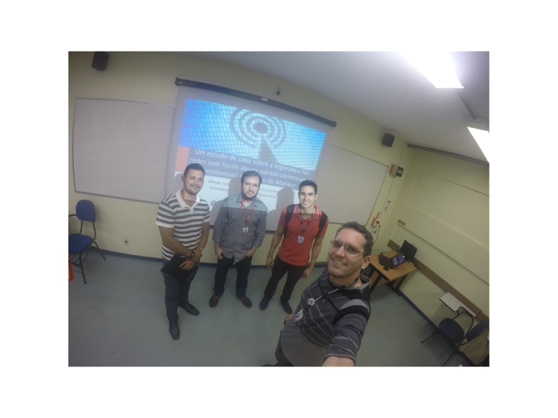

Orientação do trabalho de conclusão de curso intitulado **Um estudo de caso sobre a segurança das redes sem fio de alguns pontos comerciais e residenciais do centro de manaus** defendido pelo aluno Jose Marcelo Saraiva Gonçalves do curso de graduação em Ciência da Computação do Centro Universitário do Norte (Uninorte) no dia 13/12/2016. 

Participaram da banca o prof. Me. Diego da Silva Froner e o prof. Me. Felipe Azevedo Pinage. 

	<a class="btn btn-outline-primary mt-1" href="{{ site.baseurl }}/projects/">Voltar</a>

