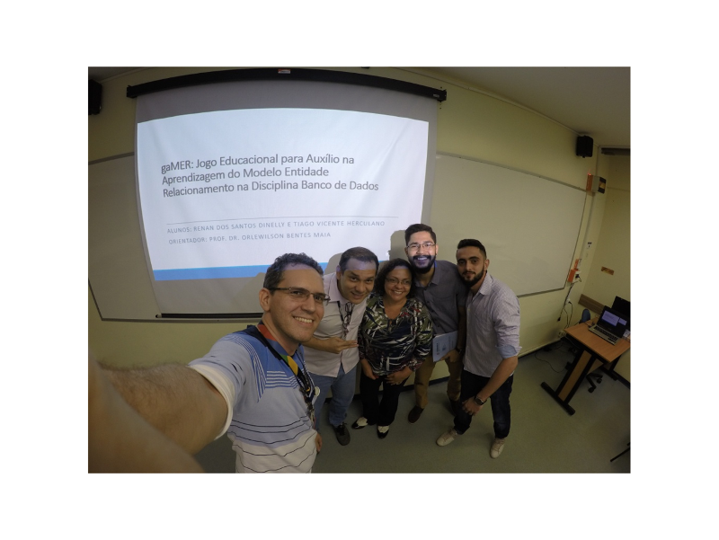

Orientação do trabalho de conclusão de curso intitulado **Gamer: jogo educacional para auxílio na aprendizagem do modelo entidade relacionamento na disciplina banco de dados** defendido pelos alunos Renan dos Santos Dinelly e Tiago Vicente Herculano do curso de graduação em Ciência da Computação do Centro Universitário do Norte (Uninorte) no dia 29/06/2017. 

Participaram da banca o prof. Esp. Alberto Vilaça Coutinho Junio e a profa. Me. Ângela Timotia Pereira Lima. 

	<a class="btn btn-outline-primary mt-1" href="{{ site.baseurl }}/projects/">Voltar</a>

