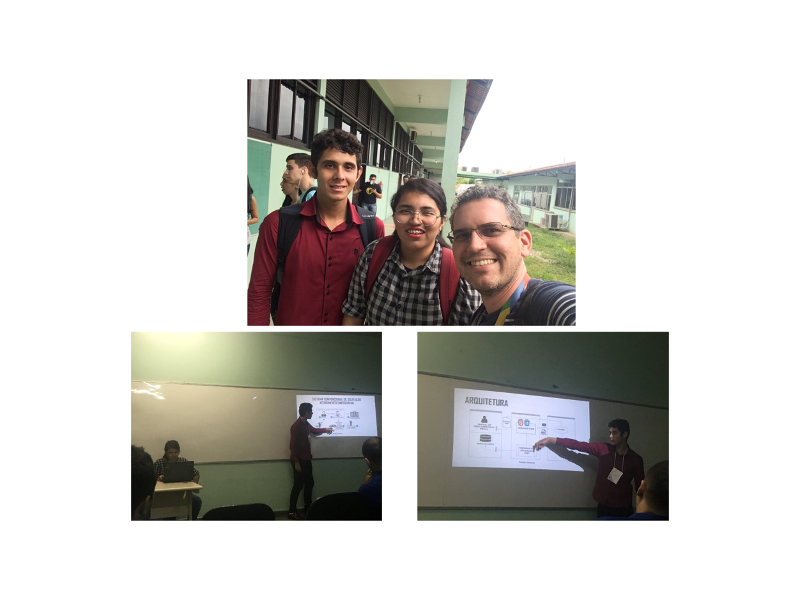

Orientação do trabalho de conclusão de curso intitulado **Proposta para agilização no processo de aquisição dos dados ao atendimento emergencial no contexto de cidades inteligentes** defendido pelos alunos Camila C. da Silva
e Yuri G. da Cruz do curso de graduação em Redes de Computadores do Centro Universitário do Norte (Uninorte) no dia 26/09/2017 na IV Escola Regional de Informática - Norte 1 (Erin).

	<a class="btn btn-outline-primary mt-1" href="{{ site.baseurl }}/projects/">Voltar</a>

